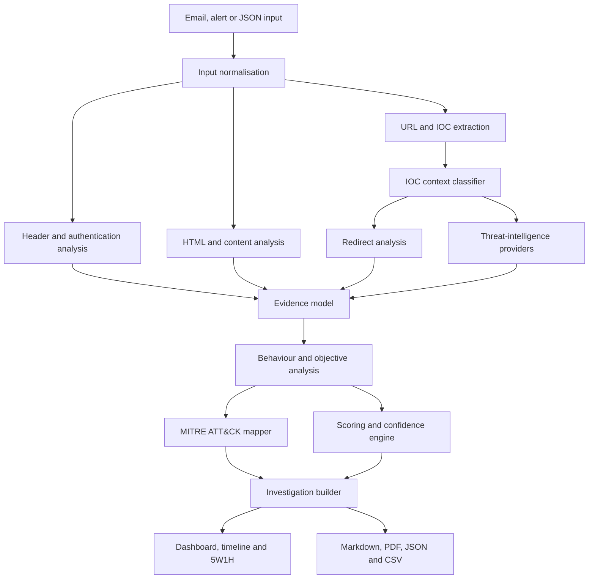

# Cyber Columbo — SOC Augmentor

> A proprietary, browser-based SOC investigation and phishing-triage platform that transforms raw alerts and suspicious emails into evidence-led, analyst-ready investigations.

## Overview

SOC Augmentor is a cybersecurity engineering project built to reduce the time and inconsistency involved in SOC alert and suspicious-email triage. It combines structured parsing, phishing analysis, contextual IOC classification, threat-intelligence enrichment, MITRE ATT&CK mapping, risk scoring, timelines, evidence traceability and professional reporting in one browser workflow.

This public repository is a **portfolio and technical case study**. It intentionally contains no proprietary application source code, API credentials, private configuration or commercially sensitive detection logic.

## The problem

Analysts often move between email gateways, SIEM alerts, reputation services, endpoint tools, threat-intelligence portals and report templates. The process can become slow, noisy and difficult to audit.

SOC Augmentor asks:

> Can an analyst provide an alert or suspicious email and receive a structured, explainable investigation containing evidence, context, likely attacker objectives, ATT&CK mappings, severity, recommended actions and a reusable report?

## Key capabilities

- Raw email, ordinary email, alert and JSON ingestion
- Normalised investigation data model
- DKIM, SPF, DMARC, ARC and DomainKey interpretation
- Received-hop and sending-infrastructure analysis
- URL extraction from text, HTML anchors, CTA buttons and resources
- Context-aware IOC classification
- Redirect and landing-page assessment
- Unicode homoglyph and mixed-script detection
- HTML, form, image and brand-impersonation analysis
- Social-engineering and attacker-objective inference
- SpamAssassin telemetry parsing
- Modular threat-intelligence enrichment
- Evidence-weighted severity and confidence scoring
- Evidence-led MITRE ATT&CK mapping
- Timeline and 5W1H generation
- Markdown, PDF, JSON and CSV outputs
- Containment, user-safety and detection-engineering guidance

## Investigation pipeline

## Why the code is private

The public portfolio demonstrates the product, engineering decisions and security methodology without exposing:

- proprietary application code;
- API secrets;
- internal thresholds and abuse controls;
- private test data;
- commercially sensitive correlation logic.

## Repository guide

| Document | Purpose |
|---|---|
| [Project overview](docs/PROJECT_OVERVIEW.md) | Problem, audience and use cases |
| [System architecture](docs/SYSTEM_ARCHITECTURE.md) | Components and data flow |
| [Build journey](docs/BUILD_JOURNEY.md) | Evolution from proof of concept to precision platform |
| [Phishing methodology](docs/PHISHING_ANALYSIS.md) | Detection dimensions and classification |
| [IOC classification](docs/IOC_CLASSIFICATION.md) | Attacker versus reference IOC handling |
| [Threat intelligence](docs/THREAT_INTELLIGENCE.md) | Provider and secrets design |
| [MITRE mapping](docs/MITRE_ATTACK_MAPPING.md) | Evidence-led ATT&CK approach |
| [Reporting engine](docs/REPORTING_ENGINE.md) | Analyst and executive outputs |
| [Engineering decisions](docs/ENGINEERING_DECISIONS.md) | Key trade-offs |
| [Skills demonstrated](docs/SKILLS_DEMONSTRATED.md) | Technical, SOC and product skills |
| [Testing](docs/TESTING_AND_VALIDATION.md) | Iterative validation and lessons |
| [Case study](docs/PORTFOLIO_CASE_STUDY.md) | Portfolio-ready project narrative |
| [Threat model](docs/THREAT_MODEL.md) | Security, privacy and limitations |
| [Roadmap](ROADMAP.md) | Future product direction |

## Skills demonstrated

The project evidences Python application engineering, modular architecture, browser UI development, email/MIME analysis, HTML parsing, API integration, caching, evidence modelling, risk scoring, phishing analysis, MITRE ATT&CK mapping, SOC triage, incident reporting, secure secrets handling, iterative testing and technical communication.

## Screenshots

To be included.

## Responsible use

SOC Augmentor is intended for authorised defensive security analysis, education and SOC workflow improvement. It should not be used to interact with suspicious infrastructure outside an approved, isolated environment.

---

**SOC Augmentor — from raw evidence to an explainable SOC decision.**
