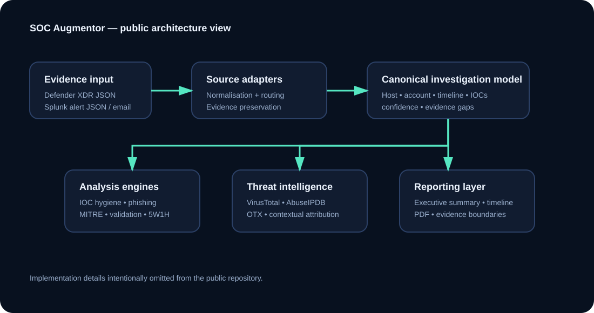

# 🛡️ SOC Augmentor - Automated SOC Invstigation and Report Generator

**Evidence led SOC analyst augmentation — public engineering portfolio**

> This repository documents the design, architecture, development and validation of SOC Augmentor.  
> **Application source code is intentionally not published** because the project may be commercialised.

[🌐 View GitHub Pages](https://grhmmckean33.github.io/Python-Automated-SOC-Investigation-and-Report-Generator/) · [🧪 Testing & Validation](testing.html) · [🗺️ Roadmap](roadmap.html) · [📄 Sample Report](reports/Defender-Alert-SOC-Augmentor.pdf)

## Recruiter quick read

SOC Augmentor is a Python/Streamlit security-engineering project built to turn supplied SOC alert evidence into a structured investigation foundation. The current V7.3.3 supports Microsoft Defender XDR and Splunk JSON workflows, contextual IOC handling, threat intelligence enrichment, MITRE ATT&CK mapping, timelines, 5W1H analysis, evidence gaps and professional PDF reporting.

The application is intentionally **human in the loop**. It does not replace a SOC analyst and does not claim to complete an investigation from alert JSON alone.

## Current capabilities

- Microsoft Defender XDR JSON alert analysis
- Splunk scheduled search/notable alert analysis
- Phishing/email analysis
- Evidence normalisation and source-aware routing
- Observed indicator vs confirmed malicious IOC separation
- VirusTotal, AbuseIPDB and OTX enrichment
- Context preserving Threat Intelligence attribution
- MITRE ATT&CK mapping
- Findings, timeline and 5W1H
- Evidence coverage, confidence and contradiction checks
- Explicit investigation scope and evidence boundaries
- Further investigation guidance
- Professional PDF/structured report generation

## Testing and accuracy

Development has used repeated benchmark comparison against manually investigated incidents. Mature case-specific benchmarks have shown approximately **97–99% alignment on the tested alert-level outputs**.

That number is **not a universal accuracy rate**. It is an informal measure of alignment on specific benchmark cases. SOC Augmentor only analyses evidence supplied to it; analysts must investigate the source SIEM/EDR and corroborate the report before final disposition.

## Current limitations

The current release:
- runs on **localhost for an individual analyst**;
- does not directly query a live Defender or Splunk tenant;
- cannot discover Sysmon, Windows, network or change-management evidence that was not supplied;
- provides the **foundation of an investigation**, not a completed Tier-2 investigation;
- requires analyst validation and corroboration.

Future work includes secure online availability, direct permissioned integrations, adding follow up investigation evidence to an existing case, broader tool/software OSINT and expanded benchmark coverage.

## Architecture

## Documentation

- [Project overview](docs/PROJECT_OVERVIEW.md)
- [Testing and validation](docs/TESTING_AND_VALIDATION.md)
- [Design decisions](docs/DESIGN_DECISIONS.md)
- [Current limitations](docs/LIMITATIONS.md)
- [Security and privacy](docs/SECURITY_AND_PRIVACY.md)
- [Skills demonstrated](docs/SKILLS_DEMONSTRATED.md)
- [Roadmap](roadmap.html)

## Public/private boundary

This repository deliberately contains **no application source code**. Public materials include architecture, testing methodology, engineering decisions, screenshots, sample reports and roadmap information only.
