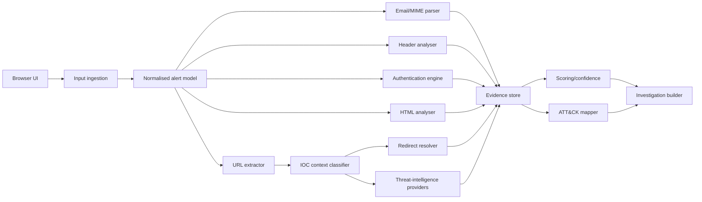

# System Architecture

SOC Augmentor uses a modular Python analysis pipeline.

## Browser interface

Streamlit enabled rapid local testing and a modern browser workflow while preserving a migration path to a future API and React frontend.

## Input normalisation

Inputs are transformed into a common internal model containing identifiers, timestamps, source, severity, user, host, IP, domain, process, command line, description and raw email.

## Email and authentication

The system distinguishes absent, invalid, unverified and valid DKIM states and considers SPF, DMARC, ARC and DomainKey evidence.

## URL and IOC pipeline

Indicators are classified before scoring. CTA links, body links, redirectors, embedded resources and documentation references receive different roles.

## Threat-intelligence layer

Providers have a common output structure. Lookups are cached and provider failures are separated from analyst findings.

## Evidence and scoring

Each finding records category, severity, confidence, source, detail and score contribution. Category caps reduce double-counting.

## Reporting

Reports prioritise the verdict, primary attack vector and top evidence, with verbose technical material placed later or in appendices.
